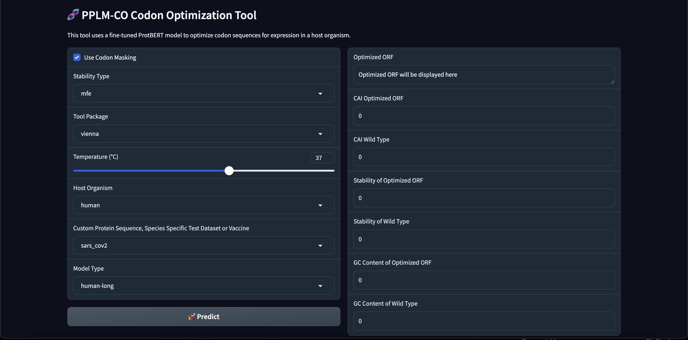

# Pre-trained Protein Language Model for Codon Optimization (PPLM-CO)

This is the offical repository for the paper [Pre-trained protein language model for codon optimization](https://www.biorxiv.org/content/10.1101/2024.12.12.628267v1). 

PPLM-CO in it's current version can test different pre-trained models for predicitin optimized open reading frame (ORF) sequences for input protein sequences for host organisms: Human, E.coli and Chinese Hamster Ovary (cho) cells.

## Dependencies and Installation
1. Clone Repo
```
git clone https://github.com/shashankcuber/Pre-trained-PPLM-Codon-Optimization.git
```
2. Install dependent packages
```
conda create -n PPLMCO python=3.9.6 -y
conda activate PPLMCO
pip3 install --upgrade pip
pip3 install -r requirements.txt
```
3. Download Models 
Adasel-ProtBert models are available for Human, E.coli and Chinese Hamster species.
Pre-trained models can be downloaded from [Google Drive]().
Save them under the folder saved_best_model

4. Test sets and Reference Set for CAI for each species.
Download them from [Google Drive]().

VZV and SARS-CoV2 Benchmark sequences are already in place in the data_preprocessing_protbert.py file.

## Quick Inference 
```
python3 gradio_app.py
```
Server will start and in the terminal you can access the url (local or public) for opening it. 

A sample interface of the tool:


## Citation
```
@article{pathak2024pre,
  title={Pre-trained protein language model for codon optimization},
  author={Pathak, Shashank and Lin, Guohui},
  journal={bioRxiv},
  pages={2024--12},
  year={2024},
  publisher={Cold Spring Harbor Laboratory}
}
```


