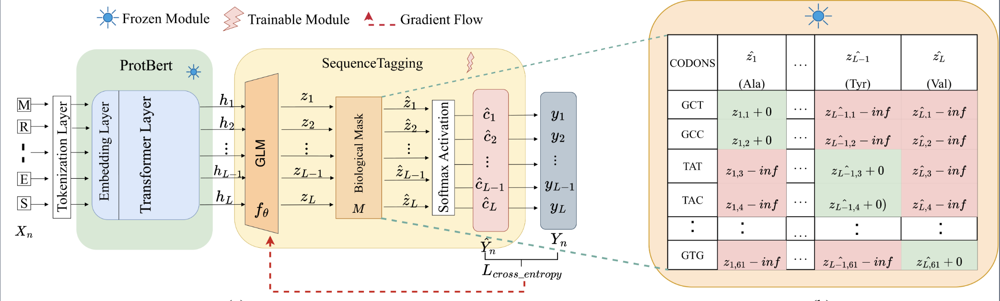
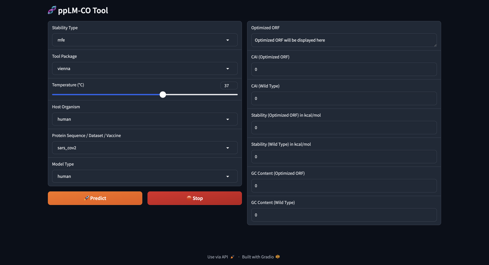

# ppLM-CO: Pre-trained Protein Language Model for Codon Optimization

### Offical repository for the paper: [ppLM-CO: Pre-trained protein language model for codon optimization](https://www.biorxiv.org/content/10.1101/2024.12.12.628267v1). 

<!-- ppLM-CO in it's current version can test different pre-trained models for predicitin optimized open reading frame (CDS) sequences for input protein sequences for host organisms: Human, E.coli and Chinese-Hamster Ovary cells. -->
<!-- **Update:** Custom Protein Sequence can now be used within the gradio app. -->

## Dependencies and Installation
1. Clone Repo
```
git clone https://github.com/shashankcuber/Pre-trained-PPLM-Codon-Optimization.git
```

2. Install dependent packages
```
conda create -n PPLMCO python=3.9.6 -y
conda activate PPLMCO
pip3 install --upgrade pip
pip3 install -r requirements.txt
```

## Model Download and Training Dataset
1. Download Models 
  - Pre-trained models can be downloaded from [Google Drive](https://drive.google.com/drive/folders/1_KEn-HY4KHhrBTsHuqBV30KEXMON7TLP?usp=sharing).

  - Save the folder **\pretrained_models** directly under the repository.

<br>

2. **Test Sets and Reference CAI Sets**

* Example test set for the Human Dataset is provided in the folder **/example_data**.
  
* Codon frequency table for each host species can be found in the folder - **/codon_frequency_table**.

* Training Dataset for all the three sequences can be found [here](https://drive.google.com/drive/folders/1_KEn-HY4KHhrBTsHuqBV30KEXMON7TLP?usp=sharing).

* **Note:** VZV and SARS-CoV-2 benchmark sequences are already included in `data_preprocessing_protbert.py`.

## Quick Inference 
* Inference on example Human test set:
  ```
  sh prot-bert-test.sh
  ```
### Gradio Interface Inference:

  ```
  python3 gradio_app.py
  ```

  * Open: [ppLM-CO Interface](http://0.0.0.0:7860)

  * Public URL is available in the terminal once the application is executed successfully.

  * A sample interface of the tool:
  

#### Description for end user input
* Host Organism: Select either of the host species from the drop down for evaluating CAI of the predicted CDS
* Model type: Select pre-trained model for a specific species. For eg: **human** for Human species trained ppLM-CO. 
* Input Protein Sequence:
  * Choose **sars-cov2-spike** (COVID-19 vaccine CDS) or **vzv-gE** (Shingles vaccine CDS) for vaccine benchmarks.  
  * For **custom protein sequences**, select `custom` from the dropdown and paste your protein sequence.  

**Note:** For **SARS-CoV-2**, the Wild-Type CAI, MFE, and GC values refer to the **Moderna (mRNA-1273) benchmark CDS**.

## Citation
```
@article{pathak2024pre,
  title={Pre-trained protein language model for codon optimization},
  author={Pathak, Shashank and Lin, Guohui},
  journal={bioRxiv},
  pages={2024--12},
  year={2024},
  publisher={Cold Spring Harbor Laboratory}
}
```